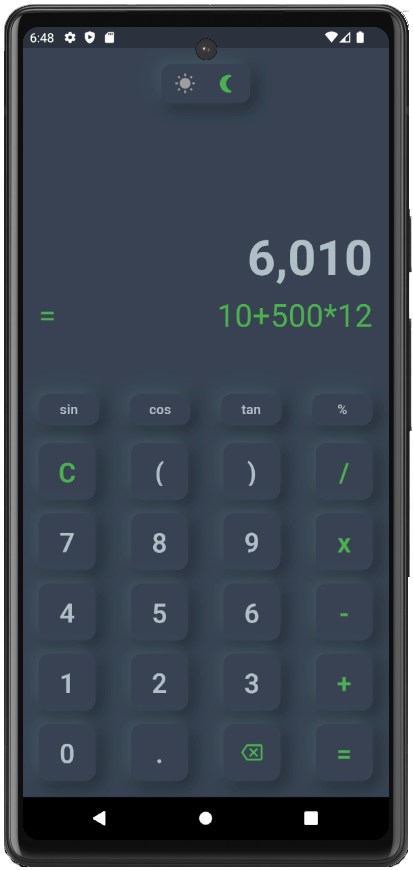
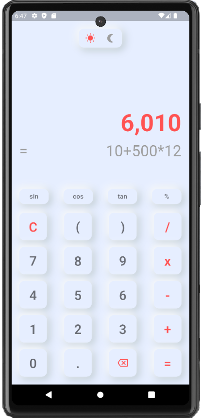

# 📱 Modern Calculator UI

A sleek and modern calculator app with both dark and light mode themes, built for a seamless user experience.

## ✨ Features

- 🌗 **Dark and Light Modes**: Switch between dark and light themes with a single toggle.
- 🔢 **Basic Operations**: COMING SOON!
- 📐 **Scientific Functions**: COMING SOON!
- 🔄 **Responsive Design**: Optimized for various screen sizes and orientations.

## 🎨 Screenshots

### Dark Mode


### Light Mode


## 🛠️ Installation

1. **Clone the repository**:
   ```bash
   git clone https://github.com/mentethical/modern_calculator_ui.git

2. **Navigate to the project directory**:
   ```bash
   cd modern_calculator_ui

3. **Install dependencies**:
   ```bash
   npm install

4. **Run the app**:
   ```bash
   npm start

## 📚 Usage

- **Toggle Theme**: Click on the sun/moon icon to switch between light and dark modes.

## 👥 Contributing
Contributions are welcome! Please read the CONTRIBUTING guidelines first.

1. **Fork the repository**.

2. **Create a new branch**:
   ```bash
   git checkout -b feature/your-feature-name

3. **Commit your changes**:
   ```bash
   git commit -m 'Add some feature'

4. **Push to the branch**:
   ```bash
   git push origin feature/your-feature-name

5. **Create a new Pull Request**.

## 📧 Contact
If you have any questions, feel free to reach out:

- **Instagram**: @mentor_buteyo

